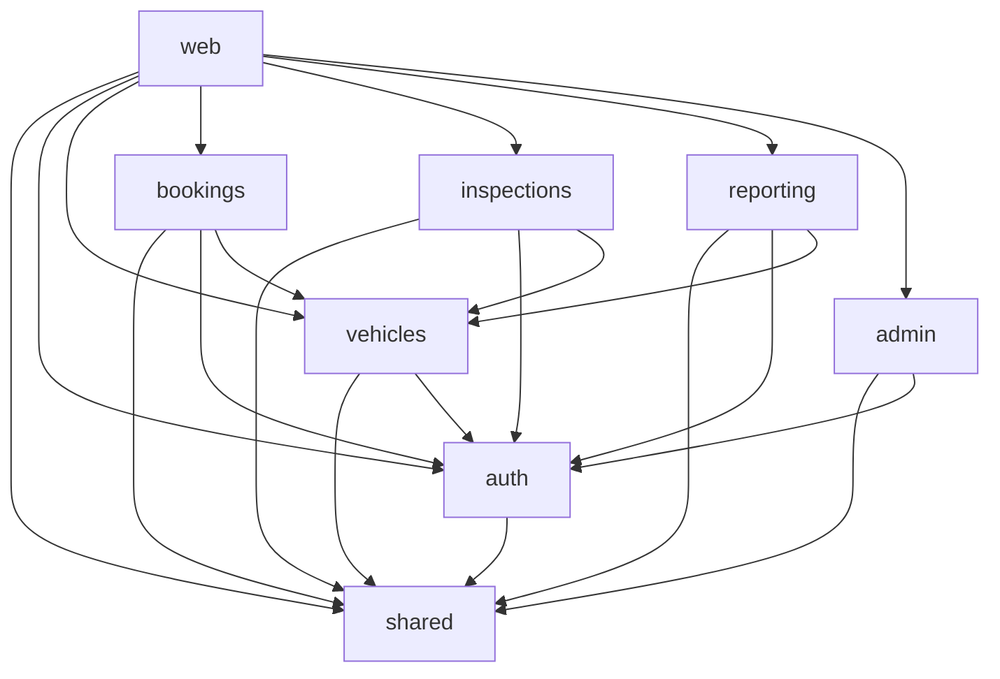

# 🏗️ Phase 3C: Monorepo Evaluation & Analysis

## 📊 **Current Project Analysis**

### **Project Overview**
- **Type:** Vehicle Fleet Management System
- **Size:** Large-scale Next.js application (200+ files)
- **Architecture:** Monolithic Next.js app with modular structure
- **Team Size:** Small to medium (1-5 developers)
- **Deployment:** Single application deployment

### **Current Structure Analysis**

#### **Functional Domains Identified:**
1. **Authentication & Authorization** (`auth/`, `admin/`)
2. **Vehicle Management** (`vehicles/`, `maintenance/`)
3. **Driver Management** (`drivers/`, `dispatch/`)
4. **Booking System** (`bookings/`, `quotations/`)
5. **Inspection System** (`inspections/`, `templates/`)
6. **Reporting & Analytics** (`reporting/`, `dashboard/`)
7. **Customer Management** (`customers/`)
8. **Payment Processing** (`paylinks/`, `omise/`)
9. **Settings & Configuration** (`settings/`, `admin/`)

#### **Current Architecture Strengths:**
- ✅ **Modular Structure** - Well-organized by feature domains
- ✅ **Shared Components** - Good reuse of UI components
- ✅ **Type Safety** - Comprehensive TypeScript usage
- ✅ **Code Splitting** - Already implemented lazy loading
- ✅ **Performance** - Optimized bundle sizes

#### **Current Architecture Challenges:**
- ⚠️ **Large Bundle Size** - Single application with all features
- ⚠️ **Deployment Coupling** - All features deploy together
- ⚠️ **Development Coupling** - Changes affect entire app
- ⚠️ **Testing Complexity** - Large test surface area
- ⚠️ **Team Coordination** - Multiple developers working on same codebase

## 🎯 **Monorepo Benefits Analysis**

### **1. Development Experience Benefits**

#### **Shared Code Management**
- **Current:** Shared components in `/components/ui/` and `/lib/`
- **Monorepo:** Dedicated packages for shared utilities
- **Benefit:** Better versioning and dependency management

#### **Cross-Package Dependencies**
- **Current:** Direct imports between modules
- **Monorepo:** Explicit package dependencies
- **Benefit:** Clear dependency graph and better refactoring

#### **Consistent Tooling**
- **Current:** Single tooling configuration
- **Monorepo:** Shared tooling across packages
- **Benefit:** Consistent linting, formatting, and testing

### **2. Deployment & Infrastructure Benefits**

#### **Independent Deployments**
- **Current:** Single deployment for all features
- **Monorepo:** Independent package deployments
- **Benefit:** Faster deployments, reduced risk

#### **Feature Flags & Gradual Rollouts**
- **Current:** All-or-nothing feature releases
- **Monorepo:** Granular feature control
- **Benefit:** Safer production releases

#### **Scaling Teams**
- **Current:** All developers work on same codebase
- **Monorepo:** Teams can own specific packages
- **Benefit:** Better team autonomy and ownership

### **3. Performance Benefits**

#### **Bundle Optimization**
- **Current:** Single large bundle
- **Monorepo:** Optimized bundles per package
- **Benefit:** Better caching and loading performance

#### **Build Optimization**
- **Current:** Full rebuild for any change
- **Monorepo:** Incremental builds
- **Benefit:** Faster development cycles

## 📋 **Proposed Monorepo Structure**

### **Package Architecture**

```
packages/
├── shared/
│   ├── ui/                    # Shared UI components
│   ├── utils/                 # Utility functions
│   ├── types/                 # Shared TypeScript types
│   ├── hooks/                 # Shared React hooks
│   └── constants/             # Shared constants
├── auth/
│   ├── components/            # Auth-specific components
│   ├── hooks/                 # Auth hooks
│   ├── services/              # Auth services
│   └── types/                 # Auth types
├── vehicles/
│   ├── components/            # Vehicle management components
│   ├── services/              # Vehicle services
│   ├── hooks/                 # Vehicle hooks
│   └── types/                 # Vehicle types
├── bookings/
│   ├── components/            # Booking components
│   ├── services/              # Booking services
│   ├── hooks/                 # Booking hooks
│   └── types/                 # Booking types
├── inspections/
│   ├── components/            # Inspection components
│   ├── services/              # Inspection services
│   ├── hooks/                 # Inspection hooks
│   └── types/                 # Inspection types
├── reporting/
│   ├── components/            # Reporting components
│   ├── services/              # Reporting services
│   ├── hooks/                 # Reporting hooks
│   └── types/                 # Reporting types
├── admin/
│   ├── components/            # Admin components
│   ├── services/              # Admin services
│   ├── hooks/                 # Admin hooks
│   └── types/                 # Admin types
└── web/
    ├── app/                   # Next.js app
    ├── components/            # App-specific components
    └── lib/                   # App-specific utilities
```

### **Package Dependencies**



## 🛠️ **Implementation Strategy**

### **Phase 1: Setup Monorepo Infrastructure**

#### **1.1 Choose Monorepo Tool**
- **Option A: Nx** - Enterprise-grade, excellent for large teams
- **Option B: Lerna** - Lightweight, good for smaller teams
- **Option C: Turborepo** - Fast, modern, Vercel-backed
- **Recommendation:** Turborepo (best fit for Next.js + Vercel)

#### **1.2 Package Structure Setup**
```bash
# Install Turborepo
npm install -g turbo

# Initialize monorepo
turbo init

# Create package structure
mkdir -p packages/{shared,auth,vehicles,bookings,inspections,reporting,admin,web}
```

#### **1.3 Shared Configuration**
- **TypeScript:** Shared `tsconfig.json` base
- **ESLint:** Shared linting rules
- **Prettier:** Shared formatting rules
- **Jest:** Shared testing configuration

### **Phase 2: Extract Shared Packages**

#### **2.1 Shared UI Package**
```typescript
// packages/shared/ui/package.json
{
  "name": "@vehicle-inspection/shared-ui",
  "version": "1.0.0",
  "main": "dist/index.js",
  "types": "dist/index.d.ts",
  "dependencies": {
    "react": "^18.0.0",
    "react-dom": "^18.0.0",
    "@radix-ui/react-*": "^1.0.0"
  }
}
```

#### **2.2 Shared Utils Package**
```typescript
// packages/shared/utils/package.json
{
  "name": "@vehicle-inspection/shared-utils",
  "version": "1.0.0",
  "main": "dist/index.js",
  "types": "dist/index.d.ts",
  "dependencies": {
    "date-fns": "^2.0.0",
    "zod": "^3.0.0"
  }
}
```

### **Phase 3: Extract Domain Packages**

#### **3.1 Vehicle Management Package**
```typescript
// packages/vehicles/package.json
{
  "name": "@vehicle-inspection/vehicles",
  "version": "1.0.0",
  "main": "dist/index.js",
  "types": "dist/index.d.ts",
  "dependencies": {
    "@vehicle-inspection/shared-ui": "workspace:*",
    "@vehicle-inspection/shared-utils": "workspace:*",
    "@vehicle-inspection/shared-types": "workspace:*"
  }
}
```

#### **3.2 Booking System Package**
```typescript
// packages/bookings/package.json
{
  "name": "@vehicle-inspection/bookings",
  "version": "1.0.0",
  "main": "dist/index.js",
  "types": "dist/index.d.ts",
  "dependencies": {
    "@vehicle-inspection/shared-ui": "workspace:*",
    "@vehicle-inspection/shared-utils": "workspace:*",
    "@vehicle-inspection/vehicles": "workspace:*",
    "@vehicle-inspection/auth": "workspace:*"
  }
}
```

### **Phase 4: Migration Strategy**

#### **4.1 Gradual Migration**
1. **Week 1-2:** Setup monorepo infrastructure
2. **Week 3-4:** Extract shared packages
3. **Week 5-6:** Extract vehicle management
4. **Week 7-8:** Extract booking system
5. **Week 9-10:** Extract inspection system
6. **Week 11-12:** Extract reporting system

#### **4.2 Migration Steps**
```bash
# 1. Create new package
mkdir packages/vehicles
cd packages/vehicles
npm init -y

# 2. Move components
mv ../../components/vehicles/* ./components/
mv ../../app/(dashboard)/vehicles/* ./app/

# 3. Update imports
find . -name "*.tsx" -exec sed -i 's/from "\.\.\/\.\.\/components/from "@vehicle-inspection\/shared-ui/g' {} \;

# 4. Update package.json
npm install @vehicle-inspection/shared-ui@workspace:*
```

## 📊 **Cost-Benefit Analysis**

### **Benefits**

#### **Development Benefits**
- ✅ **Team Autonomy** - Teams can work independently
- ✅ **Faster Development** - Smaller, focused codebases
- ✅ **Better Testing** - Isolated test suites
- ✅ **Easier Refactoring** - Clear package boundaries

#### **Deployment Benefits**
- ✅ **Independent Deployments** - Deploy only changed packages
- ✅ **Feature Flags** - Granular feature control
- ✅ **Rollback Safety** - Rollback specific features
- ✅ **Performance** - Optimized bundles per package

#### **Maintenance Benefits**
- ✅ **Clear Ownership** - Teams own specific packages
- ✅ **Version Management** - Independent versioning
- ✅ **Dependency Management** - Clear dependency graph
- ✅ **Code Reuse** - Better shared code management

### **Costs**

#### **Setup Costs**
- ⚠️ **Initial Setup** - 2-3 weeks of migration work
- ⚠️ **Learning Curve** - Team needs to learn monorepo tools
- ⚠️ **Tooling Complexity** - More complex build processes
- ⚠️ **CI/CD Changes** - Need to update deployment pipelines

#### **Ongoing Costs**
- ⚠️ **Package Management** - More complex dependency management
- ⚠️ **Version Coordination** - Need to coordinate package versions
- ⚠️ **Build Complexity** - More complex build processes
- ⚠️ **Debugging** - More complex debugging across packages

## 🎯 **Recommendation**

### **Current Assessment: NOT RECOMMENDED**

#### **Reasons Against Monorepo:**

1. **Team Size** - Small team (1-5 developers) doesn't benefit from monorepo complexity
2. **Project Maturity** - Well-established monolithic structure works well
3. **Deployment Simplicity** - Single deployment is simpler for current needs
4. **Development Speed** - Current structure allows fast development
5. **Maintenance Overhead** - Monorepo adds complexity without clear benefits

#### **Alternative Recommendations:**

1. **Micro-Frontend Architecture** - Consider micro-frontends for specific features
2. **Module Federation** - Use Webpack Module Federation for code splitting
3. **Package Extraction** - Extract only shared utilities as npm packages
4. **Workspace Organization** - Use npm workspaces for better organization

### **Future Considerations:**

#### **When to Reconsider Monorepo:**
- **Team Size** - When team grows to 10+ developers
- **Feature Complexity** - When features become very complex
- **Deployment Needs** - When independent deployments become critical
- **Performance Requirements** - When bundle size becomes a major issue

#### **Alternative Approaches:**
1. **Shared Package Strategy** - Extract shared code to npm packages
2. **Module Federation** - Use Webpack Module Federation
3. **Micro-Frontend** - Split into independent frontend applications
4. **API-First** - Split backend into microservices, keep frontend monolithic

## 📋 **Implementation Plan (If Proceeding)**

### **Phase 1: Preparation (Week 1)**
- [ ] Evaluate monorepo tools (Turborepo vs Nx vs Lerna)
- [ ] Create proof-of-concept with one package
- [ ] Train team on monorepo concepts
- [ ] Update CI/CD pipelines

### **Phase 2: Infrastructure (Week 2)**
- [ ] Setup monorepo tooling
- [ ] Create package structure
- [ ] Setup shared configurations
- [ ] Create build scripts

### **Phase 3: Migration (Weeks 3-8)**
- [ ] Extract shared packages
- [ ] Extract domain packages
- [ ] Update imports and dependencies
- [ ] Test and validate

### **Phase 4: Optimization (Weeks 9-10)**
- [ ] Optimize build processes
- [ ] Setup independent deployments
- [ ] Monitor performance
- [ ] Document processes

## 🎯 **Final Recommendation**

**DO NOT PROCEED with monorepo migration at this time.**

### **Reasons:**
1. **Current architecture is well-suited** for the project size and team
2. **Monorepo complexity** outweighs benefits for current needs
3. **Alternative approaches** (shared packages, module federation) are more appropriate
4. **Focus on optimization** rather than architectural changes

### **Next Steps:**
1. **Continue with Phase 3D** - Testing and documentation
2. **Consider shared packages** - Extract utilities to npm packages
3. **Evaluate micro-frontends** - For specific complex features
4. **Monitor team growth** - Reconsider when team scales

---

*Phase 3C Evaluation Completed: January 30, 2025*
*Recommendation: DO NOT PROCEED with monorepo migration*
*Alternative: Focus on shared packages and micro-frontend architecture*
