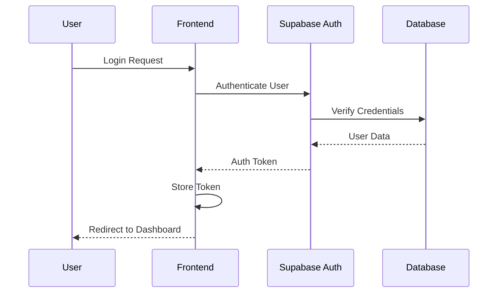
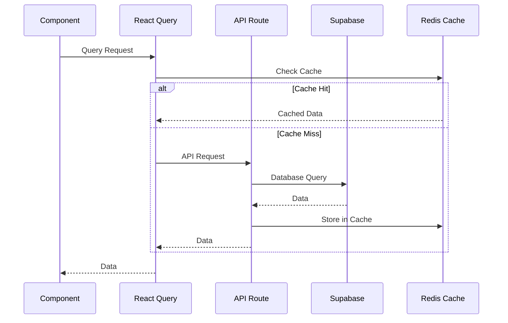
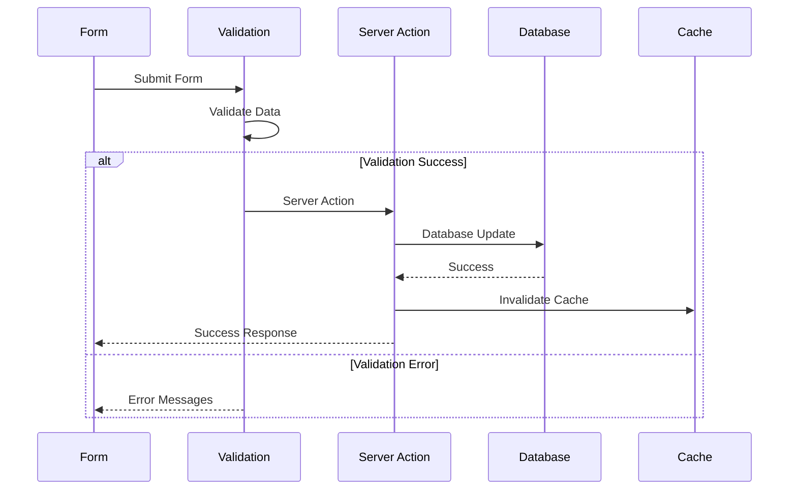

# 🏗️ System Architecture Documentation

## Overview

The Vehicle Inspection System is a comprehensive web application built with modern technologies to manage vehicle fleets, maintenance schedules, inspections, and reporting. The system follows a modular architecture with clear separation of concerns.

## Technology Stack

### Frontend
- **Framework**: Next.js 15 with App Router
- **Language**: TypeScript
- **UI Library**: React 18
- **Styling**: Tailwind CSS + Shadcn UI
- **State Management**: React Query + Zustand
- **Forms**: React Hook Form + Zod validation
- **Charts**: Recharts
- **Internationalization**: next-intl (English/Japanese)

### Backend
- **Database**: Supabase (PostgreSQL)
- **Authentication**: Supabase Auth
- **File Storage**: Supabase Storage
- **API**: Next.js API Routes + Server Actions
- **Caching**: Redis (Upstash)
- **Email**: Resend API

### Development & Testing
- **Testing**: Vitest + Playwright + Testing Library
- **Linting**: ESLint + Prettier
- **Type Checking**: TypeScript
- **Build Tool**: Next.js (Webpack)
- **Package Manager**: npm

## System Architecture

### High-Level Architecture

```
┌─────────────────┐    ┌─────────────────┐    ┌─────────────────┐
│   Frontend      │    │   Backend       │    │   External      │
│   (Next.js)     │    │   (Supabase)    │    │   Services      │
├─────────────────┤    ├─────────────────┤    ├─────────────────┤
│ • React App     │    │ • PostgreSQL    │    │ • Resend API    │
│ • TypeScript    │    │ • Auth          │    │ • Redis Cache   │
│ • Tailwind CSS  │    │ • Storage       │    │ • WordPress API │
│ • React Query   │    │ • Edge Functions│    │ • Omise Payment │
└─────────────────┘    └─────────────────┘    └─────────────────┘
```

### Component Architecture

```
app/
├── (auth)/                 # Authentication routes
│   ├── login/             # Login page
│   └── layout.tsx         # Auth layout
├── (dashboard)/           # Main application routes
│   ├── dashboard/         # Dashboard page
│   ├── vehicles/          # Vehicle management
│   ├── bookings/          # Booking system
│   ├── inspections/       # Inspection system
│   ├── maintenance/       # Maintenance system
│   ├── reporting/         # Reporting system
│   └── settings/          # User settings
├── api/                   # API routes
│   ├── auth/              # Authentication APIs
│   ├── vehicles/          # Vehicle APIs
│   ├── bookings/          # Booking APIs
│   ├── inspections/       # Inspection APIs
│   └── admin/             # Admin APIs
└── layout.tsx             # Root layout

components/
├── ui/                    # Shared UI components
├── dashboard/             # Dashboard components
├── vehicles/              # Vehicle components
├── bookings/              # Booking components
├── inspections/           # Inspection components
├── maintenance/           # Maintenance components
├── reporting/             # Reporting components
├── shared/                # Shared components
└── providers/             # Context providers

lib/
├── auth/                  # Authentication utilities
├── db/                    # Database utilities
├── services/              # Business logic
├── utils/                 # Utility functions
├── hooks/                 # Custom React hooks
├── supabase/              # Supabase client
└── validations/           # Form validations
```

## Data Flow

### 1. Authentication Flow



### 2. Data Fetching Flow



### 3. Form Submission Flow



## Database Schema

### Core Tables

#### Users & Authentication
```sql
-- User profiles and authentication
users (
  id UUID PRIMARY KEY,
  email VARCHAR UNIQUE NOT NULL,
  role VARCHAR NOT NULL,
  permissions JSONB,
  created_at TIMESTAMP,
  updated_at TIMESTAMP
)

-- User groups for role-based access
user_groups (
  id UUID PRIMARY KEY,
  name VARCHAR NOT NULL,
  description TEXT,
  permissions JSONB,
  created_at TIMESTAMP
)
```

#### Vehicle Management
```sql
-- Vehicle information
vehicles (
  id UUID PRIMARY KEY,
  name VARCHAR NOT NULL,
  license_plate VARCHAR UNIQUE,
  status VARCHAR NOT NULL,
  created_at TIMESTAMP,
  updated_at TIMESTAMP
)

-- Vehicle maintenance records
maintenance_tasks (
  id UUID PRIMARY KEY,
  vehicle_id UUID REFERENCES vehicles(id),
  title VARCHAR NOT NULL,
  description TEXT,
  status VARCHAR NOT NULL,
  due_date DATE,
  created_at TIMESTAMP
)
```

#### Inspection System
```sql
-- Inspection records
inspections (
  id UUID PRIMARY KEY,
  vehicle_id UUID REFERENCES vehicles(id),
  inspector_id UUID REFERENCES users(id),
  type VARCHAR NOT NULL,
  status VARCHAR NOT NULL,
  date DATE NOT NULL,
  created_at TIMESTAMP
)

-- Inspection templates
inspection_templates (
  id UUID PRIMARY KEY,
  name VARCHAR NOT NULL,
  type VARCHAR NOT NULL,
  sections JSONB,
  created_at TIMESTAMP
)
```

#### Booking System
```sql
-- Booking records
bookings (
  id UUID PRIMARY KEY,
  customer_name VARCHAR NOT NULL,
  pickup_location TEXT,
  dropoff_location TEXT,
  date DATE NOT NULL,
  time TIME NOT NULL,
  status VARCHAR NOT NULL,
  created_at TIMESTAMP
)

-- Quotations
quotations (
  id UUID PRIMARY KEY,
  customer_name VARCHAR NOT NULL,
  total_amount DECIMAL,
  currency VARCHAR,
  status VARCHAR NOT NULL,
  created_at TIMESTAMP
)
```

## Performance Optimizations

### 1. Code Splitting
- **Lazy Loading**: Components loaded on demand
- **Route-based Splitting**: Each page is a separate chunk
- **Library Splitting**: Heavy libraries (Recharts, PDF) loaded separately

### 2. Database Optimizations
- **Indexes**: Optimized indexes for common queries
- **Query Functions**: PostgreSQL functions for complex operations
- **Connection Pooling**: Efficient database connections

### 3. Caching Strategy
- **Redis Cache**: API responses and computed data
- **Browser Cache**: Static assets and API responses
- **CDN**: Global content delivery

### 4. Bundle Optimization
- **Tree Shaking**: Remove unused code
- **Minification**: Compress JavaScript and CSS
- **Image Optimization**: WebP format and lazy loading

## Security Architecture

### 1. Authentication
- **Supabase Auth**: Secure authentication system
- **JWT Tokens**: Stateless authentication
- **Session Management**: Secure session handling

### 2. Authorization
- **Role-based Access**: User roles and permissions
- **Route Protection**: Protected routes and middleware
- **API Security**: Server-side validation

### 3. Data Protection
- **Input Validation**: Zod schema validation
- **SQL Injection Prevention**: Parameterized queries
- **XSS Protection**: Content Security Policy

### 4. Environment Security
- **Environment Variables**: Secure configuration
- **API Keys**: Secure key management
- **HTTPS**: Encrypted communication

## Deployment Architecture

### 1. Frontend Deployment
- **Platform**: Vercel
- **Build Process**: Next.js build
- **CDN**: Global edge network
- **Environment**: Production/Staging

### 2. Backend Deployment
- **Database**: Supabase Cloud
- **API**: Vercel Serverless Functions
- **Storage**: Supabase Storage
- **Cache**: Upstash Redis

### 3. CI/CD Pipeline
- **Source Control**: GitHub
- **Testing**: Automated test suite
- **Deployment**: Automatic deployment
- **Monitoring**: Error tracking and analytics

## Monitoring & Observability

### 1. Error Tracking
- **Sentry**: Error monitoring and performance tracking
- **Logging**: Structured logging
- **Alerts**: Error notifications

### 2. Performance Monitoring
- **Web Vitals**: Core web vitals tracking
- **Bundle Analysis**: Bundle size monitoring
- **Database Performance**: Query performance tracking

### 3. User Analytics
- **Usage Tracking**: Feature usage analytics
- **Performance Metrics**: User experience metrics
- **Error Rates**: Application stability metrics

## Scalability Considerations

### 1. Horizontal Scaling
- **Stateless Architecture**: No server-side state
- **CDN**: Global content delivery
- **Database Scaling**: Supabase auto-scaling

### 2. Vertical Scaling
- **Code Optimization**: Efficient algorithms
- **Caching**: Reduce database load
- **Bundle Optimization**: Faster loading

### 3. Future Enhancements
- **Microservices**: Service decomposition
- **Event-driven Architecture**: Async processing
- **Real-time Features**: WebSocket integration

## Development Guidelines

### 1. Code Organization
- **Feature-based Structure**: Group by functionality
- **Shared Components**: Reusable UI components
- **Custom Hooks**: Business logic abstraction

### 2. Testing Strategy
- **Unit Tests**: Component and function testing
- **Integration Tests**: API and service testing
- **E2E Tests**: User journey testing

### 3. Documentation
- **Code Documentation**: JSDoc comments
- **API Documentation**: OpenAPI specifications
- **Architecture Documentation**: System design docs

---

*Architecture Documentation - Last Updated: January 30, 2025*
*Version: 1.0*
*Status: Current*
