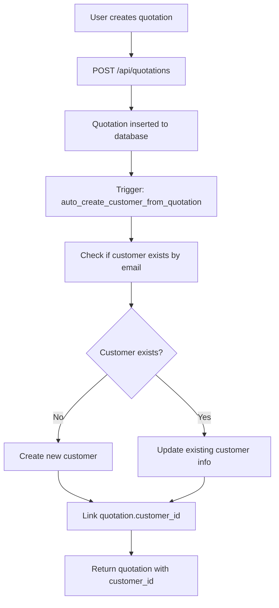
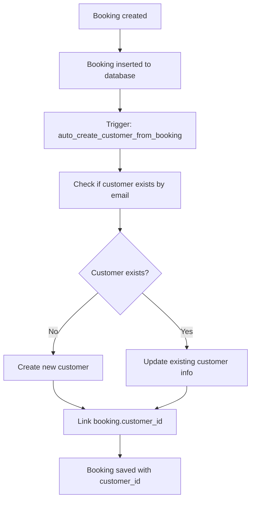

# Automatic Customer Creation System

This document explains how the automatic customer creation system works in your vehicle inspection application.

## 🎯 Overview

The system automatically creates customer records when:
1. **Creating a new quotation** with customer email/name/phone
2. **Creating a new booking** with customer email/name/phone
3. **Converting quotations to bookings** (customers are already linked)
4. **Syncing bookings from WordPress** (existing functionality enhanced)

## 🏗️ System Architecture

### Database Components

1. **Tables**:
   - `customers` - Main customer records
   - `customer_segments` - Customer segmentation (VIP, Corporate, Regular, Occasional)
   - `quotations` - Enhanced with automatic customer linking
   - `bookings` - Enhanced with automatic customer linking

2. **Functions**:
   - `upsert_customer()` - Creates or updates customer with deduplication
   - `auto_create_customer_from_quotation()` - Trigger function for quotations
   - `auto_create_customer_from_booking()` - Trigger function for bookings
   - `create_customer_from_api()` - API-friendly customer creation

3. **Triggers**:
   - `trigger_auto_create_customer_quotation` - Runs on quotation INSERT/UPDATE
   - `trigger_auto_create_customer_booking` - Runs on booking INSERT/UPDATE

### API Integration

The system works seamlessly with existing API endpoints:
- `POST /api/quotations` ✅ Automatically creates customers
- `POST /api/quotations/convert` ✅ Automatically creates customers  
- `POST /api/bookings/sync` ✅ Automatically creates customers
- `POST /api/customers` ✅ Manual customer creation

## 🔄 How It Works

### 1. Quotation Creation Flow



### 2. Booking Creation Flow



### 3. Data Deduplication Logic

The system prevents duplicate customers using:

1. **Email as Primary Key**: Customers are matched by email (case-insensitive)
2. **Smart Updates**: If customer exists, system updates name/phone if new data is provided
3. **Notes Consolidation**: New notes are appended to existing notes
4. **Data Cleaning**: Removes extra spaces, standardizes format

## 📊 Migration Results

After running the migration script, you'll see:

```
Migration completed successfully:
- Total customers: X (created from quotations + bookings)
- Quotations linked to customers: Y
- Bookings linked to customers: Z
```

## 🎨 Customer Segmentation

### Default Segments Created:
1. **VIP** 👑 - High-value customers (Gold color)
2. **Corporate** 🏢 - Business clients (Blue color)  
3. **Regular** 👤 - Standard customers (Gray color)
4. **Occasional** 📅 - Infrequent customers (Green color)

### Auto-Assignment Rules:
- Customers can be manually assigned to segments
- Bulk assignment based on spending patterns
- API functions for programmatic assignment

## 🔧 API Functions Available

### Manual Customer Operations

```typescript
// Ensure customer exists (create if needed)
const { customer_id, created } = await ensureCustomerExists({
  email: 'customer@example.com',
  name: 'John Doe',
  phone: '+1234567890',
  segment_id: 'vip-segment-id'
})

// Get customer by email
const customer = await getCustomerByEmail('customer@example.com')

// Assign customer to segment
await assignCustomerSegment(customerId, segmentId)

// Bulk segment assignment
await bulkAssignSegments('vip-segment-id', {
  min_spending: 100000,
  email_domains: ['company.com']
})
```

## 🚀 Usage Examples

### Creating a Quotation (Automatic Customer Creation)

```javascript
const quotationData = {
  title: "Airport Transfer Service",
  customer_email: "john.doe@example.com",
  customer_name: "John Doe",
  customer_phone: "+1234567890",
  vehicle_type: "sedan",
  amount: 15000,
  currency: "JPY"
}

// POST to /api/quotations
// Customer is automatically created and linked
```

### Converting Quotation to Booking

```javascript
// POST to /api/quotations/convert
{
  quotation_id: "quote-uuid-here"
}
// Customer is automatically linked to new booking(s)
```

## 📈 Analytics & Reporting

The `customer_analytics` view provides:
- Total customer lifetime value
- Quotation/booking counts per customer
- Last activity dates
- Segment-based grouping

## 🛠️ Maintenance

### Regular Tasks:
1. **Segment Assignment**: Review customers without segments
2. **Data Quality**: Check for duplicate customers with similar emails
3. **Analytics Review**: Monitor customer spending patterns

### Monitoring:
- Check trigger execution in database logs
- Monitor customer creation rates
- Verify quotation/booking linkage

## 🔒 Security & Permissions

- All customer functions require authentication
- Row Level Security (RLS) policies protect customer data
- API functions validate input data
- Automatic data cleaning prevents injection

## ⚡ Performance

- Triggers execute efficiently during INSERT/UPDATE
- Indexed email lookups for fast customer matching  
- Batch operations available for bulk segment assignment
- Analytics view pre-computes spending calculations

## 🐛 Troubleshooting

### Common Issues:

1. **Customer not created**: Check email format and trigger execution
2. **Duplicate customers**: Review email normalization logic
3. **Missing customer_id**: Verify trigger is enabled and functioning
4. **Segment assignment fails**: Check segment_id validity

### Debug Queries:

```sql
-- Check trigger status
SELECT * FROM information_schema.triggers 
WHERE trigger_name LIKE '%customer%';

-- View recent customer creations
SELECT * FROM customers 
WHERE created_at > NOW() - INTERVAL '1 day'
ORDER BY created_at DESC;

-- Check quotations without customer links
SELECT * FROM quotations 
WHERE customer_email IS NOT NULL 
AND customer_id IS NULL;
```

This system ensures that every quotation and booking automatically creates and maintains customer relationships, providing comprehensive customer analytics and relationship management! 🎉
